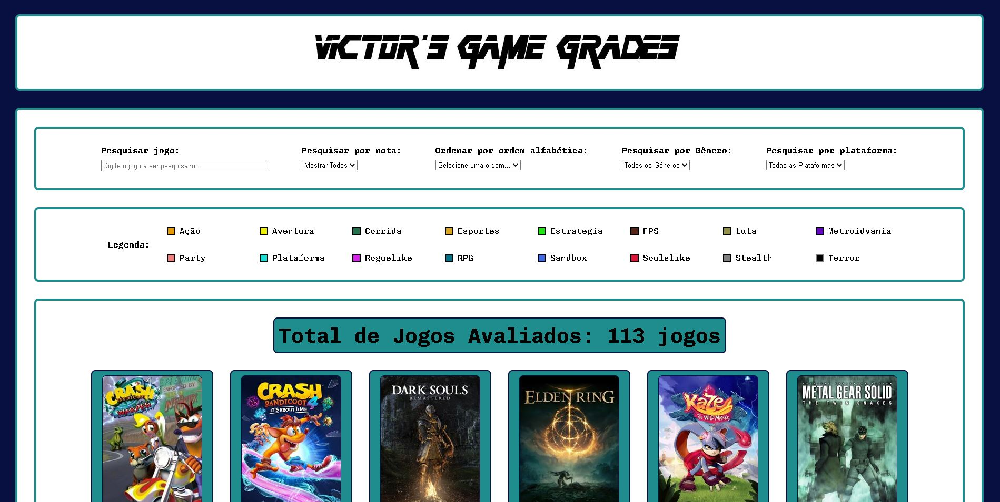
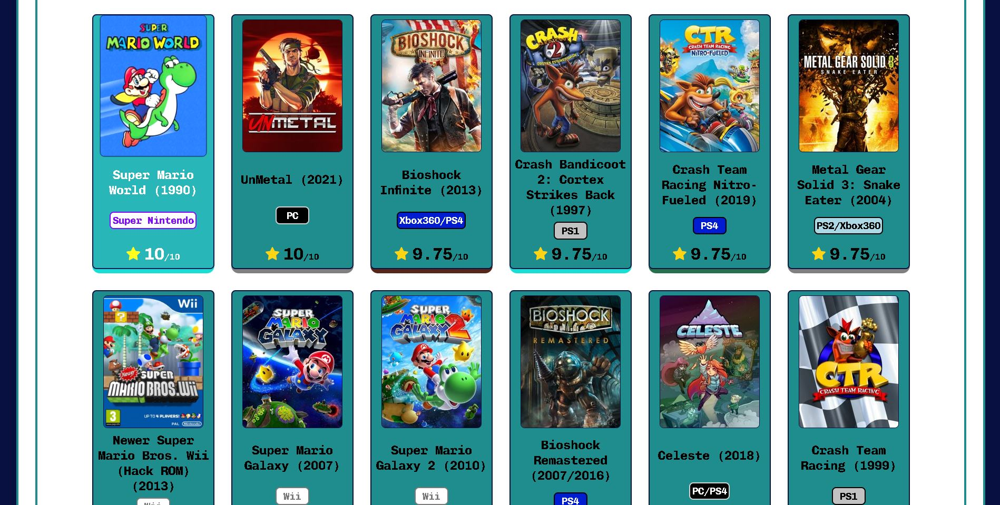

<h1 align="center"> Projeto Game Grades </h1>

Projeto criado para listar avaliações de games jogados, criado por mim (Victor Pimenta).

<a href="#tecnologias">Tecnologias</a>&nbsp;&nbsp;&nbsp;|&nbsp;&nbsp;&nbsp;
<a href="#projeto">Projeto</a>

 

Imagem da parte superior da página (Imagem 1).

 

Imagem da parte da lista de games (Imagem 2).

## Tecnologias

Esse projeto foi desenvolvido com as seguintes tecnologias:

- HTML e CSS
- JavaScript
- Git e Github

## Projeto

O Projeto Game Grades é um projeto que lista games que foram jogados pelo autor, avaliados com nota de 0 a 10, com ferramentas de pesquisa para filtrar os jogos. Filtros: Por nome do jogo, por nota, por ordem alfabética (NOTA: ESTA FUNCIONALIDADE NÃO ESTÁ FUNCIONANDO NO MOMENTO), por gênero e por plataforma (console).

---

Projeto realizado por Victor Pimenta. [LinkedIn](https://www.linkedin.com/in/victor-cardoso-pimenta-0250371a0/)